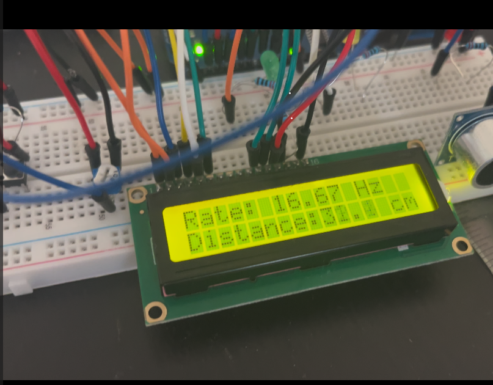

# Ultrasonic sensor with LCD

I combined the code for the ultrasonic sensor to dynamically show the distance between it and an object displaying the distance and rate on the LCD screen.

 ## Video Demonstration

Click the thumbnail below:

